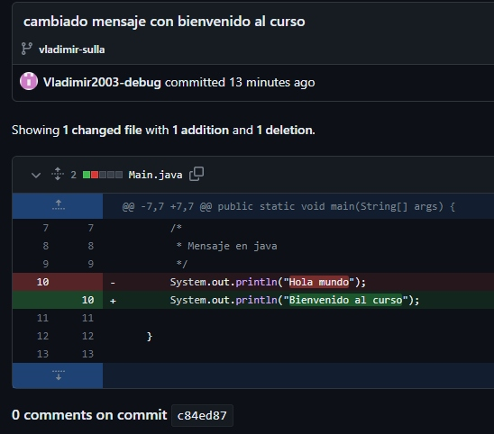

<div align="center">
<table>
    <theader>
        <tr>
            <td></td>
            <th>
                <span style="font-weight:bold;">UNIVERSIDAD NACIONAL DE SAN AGUSTIN</span><br />
                <span style="font-weight:bold;">FACULTAD DE INGENIERÍA DE PRODUCCIÓN Y SERVICIOS</span><br />
                <span style="font-weight:bold;">DEPARTAMENTO ACADÉMICO DE INGENIERÍA DE SISTEMAS E INFORMÁTICA</span><br />
                <span style="font-weight:bold;">ESCUELA PROFESIONAL DE INGENIERÍA DE SISTEMAS</span>
            </th>
            <td></td>
        </tr>
    </theader>
    <tbody>
        <tr><td colspan="3"><span style="font-weight:bold;">Formato</span>: Informe de Laboratorio</td></tr>
        <tr><td><span style="font-weight:bold;">Aprobación</span>:  2022/03/01</td><td><span style="font-weight:bold;">Código</span>: GUIA-PRLD-001</td><td><span style="font-weight:bold;">Página</span>: 1</td></tr>
    </tbody>
</table>
</div>

<div align="center">
<span style="font-weight:bold;">INFORME DE LABORATORIO</span><br />
</div>


<table>
<theader>
<tr><th colspan="6">INFORMACIÓN BÁSICA</th></tr>
</theader>
<tbody>
<tr><td>ASIGNATURA:</td><td colspan="5">Programación Web 2</td></tr>
<tr><td>TÍTULO DE LA PRÁCTICA:</td><td colspan="5">Vim - Git - GitHub</td></tr>
<tr>
<td>NÚMERO DE PRÁCTICA:</td><td>01</td><td>AÑO LECTIVO:</td><td>2022 A</td><td>NRO. SEMESTRE:</td><td>III</td>
</tr>
<tr>
<td>FECHA INICIO::</td><td>25-Abr-2022</td><td>FECHA FIN:</td><td>29-Abr-2022</td><td>DURACIÓN:</td><td>04 horas</td>
</tr>
<tr><td colspan="6">RECURSOS:
    <ul>
        <li><a href="https://git-scm.com/book/es/v2">https://git-scm.com/book/es/v2</a></li>
        <li><a href="https://guides.github.com/">https://guides.github.com/</a></li>        
        <li><a href="https://www.w3schools.com/java/default.asp">https://www.w3schools.com/java/default.asp</a></li>
    </ul>
</td>
</<tr>
<tr><td colspan="6">INTEGRANTES:
<ul>
<li>Vladimir Arturo Sulla Quispe - vsullaq@unsa.edu.pe</li>
</ul>
</td>
</<tr>
</tdbody>
</table>

# Vim - Git - GitHub

## OBJETIVOS TEMAS Y COMPETENCIAS

### OBJETIVOS

- Conocer el editor de texto Vim.
- Aprender a manejar el sistema de control de versiones Git y utilizar GitHub para trabajar de manera colaborativa.

### TEMAS
- Editor Vim
- Java
- Git
- GitHub

<details>
<summary>COMPETENCIAS</summary>

- C.c Diseña responsablemente sistemas, componentes o procesos para satisfacer necesidades dentro de restricciones realistas: económicas, medio ambientales, sociales, políticas, éticas, de salud, de seguridad, manufacturación y sostenibilidad.
- C.m Construye responsablemente soluciones siguiendo un proceso adecuado llevando a cabo las pruebas ajustada a los recursos disponibles del cliente.
- C.p Aplica de forma flexible técnicas, métodos, principios, normas, estándares y herramientas de ingeniería necesarias para la construcción de software e implementación de sistemas de información.

</details>

## CONTENIDO

### EJERCICIO 1

- Cree una cuenta de usuario en GitHub usando su correo institucional.
[opcional por ahora] Configure su cuenta de estudiante (https://education.github.com/pack).

### Solucion

- creacion de la cuenta y el repositorio


<br>

### EJERCICIO 2

- Cree un nuevo proyecto personal y desarrolle el ejercicio resuelto en clase. Haga 3 commits como mínimo y muéstrelos. Commit para "¡Hola mundo!", otro para "Bienvenida al curso" y otro para imprimir su nombre.

### Solucion

- Creacion de main con el mensaje "Hola Mundo"
<br>


- Cambio a "Bienvenido al curso"  
<br>



- Cambio con mi nombre completo
<br>


### EJERCICIO 3
- Cree un proyecto grupal para resolver el siguiente problema: Se desea crear una clase Calculator en Java, que tenga las siguientes operaciones: add, sub, mul, div, mod; estas operaciones recibirán dos enteros y devolverán un entero. (Forme grupos de 3 a 5 personas). Cree ramas para cada integrante y cada cierto tiempo una las ramas al main. No elimine nada para evidenciar ramas, main y commits.
- Debería haber minimo 7 commits:
    - 1er commit - Creación de la plantilla "Calculator.java"
    - 2do commit - Uniendo rama "ramma-add" al "main" para obtener metodo add().
    - 3er commit - Uniendo rama "ramma-sub" al "main" para obtener metodo sub().
    - 4to commit - Uniendo rama "ramma-mul" al "main" para obtener metodo mul().
    - 5to commit - Uniendo rama "ramma-div" al "main" para obtener metodo div().
    - 6to commit - Uniendo rama "ramma-mod" al "main" para obtener metodo mod().

### Solucion

- Se crean los metodos en las diferentes ramas

    - ramma-add 

    ```java
    public class Calculator {
        /**
        * Metodo que suma dos numeros enteros
        * @param a : primer sumando
        * @param b : segundo sumando
        * @return suma
        */
        public static int add(int a,int b) {
            return a + b; 
        }
    }

    ```

    - ramma-sub

    ```java
    public class Calculator {
        /**
        * Metodo que resta dos numeros
        * @param a : Minuendo
        * @param b : Sustraendo
        * @return Diferencia
        */
        public static int sub(int a ,int b) {
            return a-b;
        }
    }

    ```

    - ramma-mul
    ```java
    public class Calculator {
        /**
         * Metodo que multiplica dos numeros
         * @param a : factor
         * @param b : factor
         * @return El producto de los numeros
         */
        public static int mul(int a, int b) {
            return a * b;
        }
    }
    ``` 

    - ramma-div
    ```java
    public class Calculator {
        /**
        * Metodo que divide un numero y retorna un entero
        * @param a : Dividendo
        * @param b : Divisor
        * @return : Cociente(entero)
        */
        public static int div(int a, int b) {
            return a/b;
        }
    }
    ```

    - ramma-mod
    ```java
    public class Calculator {
        /**
        * Metodo que saca el modulo de un numero
        * @param a : Dividendo
        * @param a : Divisor
        * @return Residuo
        */
        public static int mod(int a, int b) {
        return a % b; 
        }
    }
    ```
- Luego se van uniendose a la ramma principal main


## CUESTIONARIO
- ¿Por qué Git y GitHub son herramientas importantes para el curso?
    - Por que son herramientas que seran usadas para la presentacion de los laboratorios.

- ¿Qué conductas éticas deberían promocionarse cuando se usa un Sistema de Control de Versiones?
    - Algunas conductas eticas de acuerdo al codigo de conducta de github son las siguientes
        - Usar un lenguaje acogedor e inclusivo
        - Ser respetuoso con los diferentes puntos de vista y experiencias.
        - Aceptar con gracia la crítica constructiva
        - Centrarse en lo que es mejor para la comunidad.
        - Mostrar empatía hacia otros miembros de la comunidad.
    - Cabe resaltar que se pueden añadir tus propios codigos de conducta
- ¿Qué son los entándares de codificación?
    - Los estandares de codificacion son reglas y guias que permiten un facil entendimiento entre codigo y programadores estos varian de acuerdo a cada lenguaje.

## REFERENCIAS
- https://docs.github.com/es/communities/setting-up-your-project-for-healthy-contributions/adding-a-code-of-conduct-to-your-project
- https://git-scm.com/book/es/v2
- https://guides.github.com/
- https://www.w3schools.com/java/default.asp

- Nano vs. Emacs vs. Vim (Editor Wars!) - https://www.linuxtrainingacademy.com/nano-emacs-vim/
- Emacs vs Vim - https://www.linuxteaching.com/article/emacs_vs_vim
- Vim or Emacs? The Debate is over… - https://cmd.com/blog/vim-or-emacs-the-debate-is-over/
- Por qué un editor de texto de hace 40 años machaca al "todopoderoso" Atom - https://www.xataka.com/aplicaciones/por-que-un-editor-de-texto-de-hace-40-anos-le-da-sopas-con-ondas-al-todopoderoso-atom

- Tutorial de Vim - http://www.truth.sk/vim/vimbook-OPL.pdf
- Teclado en Vim - http://www.viemu.com/vi-vim-cheat-sheet.gif
- Cómo Configurar VIM como VS Code - https://www.youtube.com/watch?v=XgQFzi3VkC8

- Empezando el Curso de Java - https://www.youtube.com/playlist?list=PLw8RQJQ8K1yQDqPyDRzt-h8YlBj96OwMP
- The Java® Language Specification Java SE 11 Edition - https://docs.oracle.com/javase/specs/jls/se11/html/index.html
- The Java™ Tutorials - https://docs.oracle.com/javase/tutorial/
- Java Course - http://www.vias.org/javacourse/wrapnt4F38D8_object_oriented_programming.html

#
