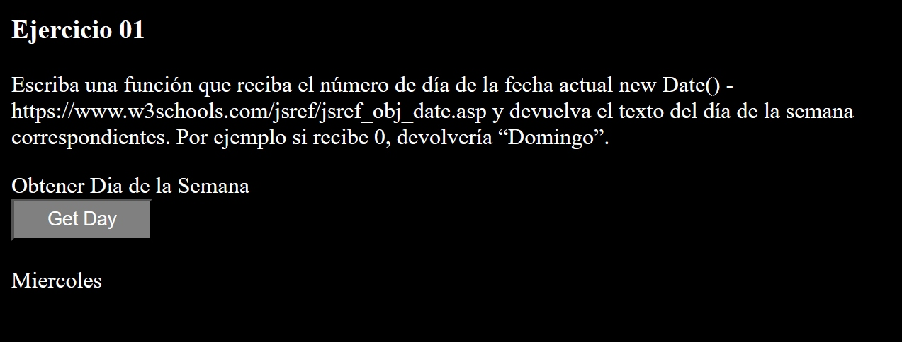
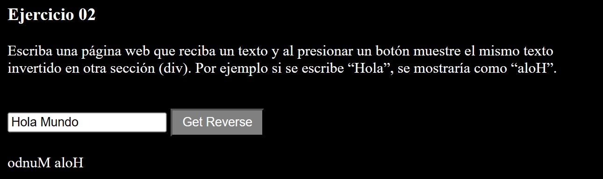
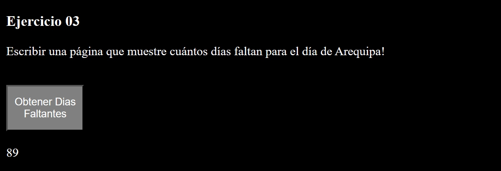
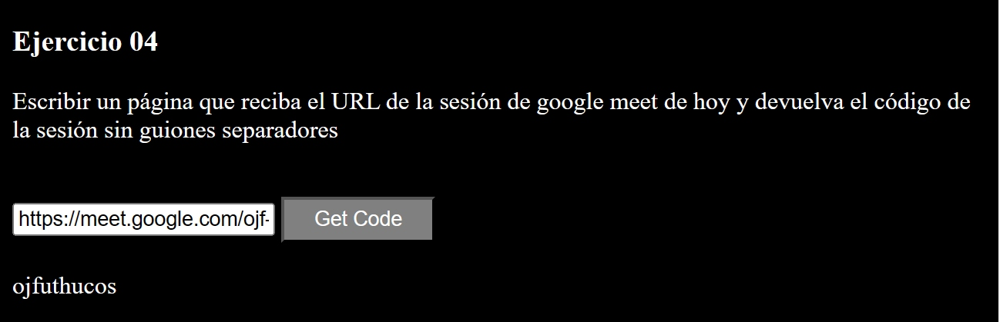
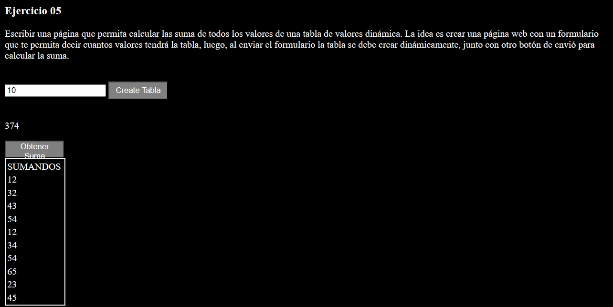

<div align="center">
<table>
    <theader>
        <tr>
            <td></td>
            <th>
                <span style="font-weight:bold;">UNIVERSIDAD NACIONAL DE SAN AGUSTIN</span><br />
                <span style="font-weight:bold;">FACULTAD DE INGENIERÍA DE PRODUCCIÓN Y SERVICIOS</span><br />
                <span style="font-weight:bold;">DEPARTAMENTO ACADÉMICO DE INGENIERÍA DE SISTEMAS E INFORMÁTICA</span><br />
                <span style="font-weight:bold;">ESCUELA PROFESIONAL DE INGENIERÍA DE SISTEMAS</span>
            </th>
            <td></td>
        </tr>
    </theader>
    <tbody>
        <tr><td colspan="3"><span style="font-weight:bold;">Formato</span>: Informe de Laboratorio</td></tr>
        <tr><td><span style="font-weight:bold;">Aprobación</span>:  2022/03/01</td><td><span style="font-weight:bold;">Código</span>: GUIA-PRLD-001</td><td><span style="font-weight:bold;">Página</span>: 1</td></tr>
    </tbody>
</table>
</div>

<div align="center">
<span style="font-weight:bold;">INFORME DE LABORATORIO</span><br />
</div>


<table>
<theader>
<tr><th colspan="6">INFORMACIÓN BÁSICA</th></tr>
</theader>
<tbody>
<tr><td>ASIGNATURA:</td><td colspan="5">Programación Web 2</td></tr>
<tr><td>TÍTULO DE LA PRÁCTICA:</td><td colspan="5">Javacript</td></tr>
<tr>
<td>NÚMERO DE PRÁCTICA:</td><td>02</td><td>AÑO LECTIVO:</td><td>2022 A</td><td>NRO. SEMESTRE:</td><td>III</td>
</tr>
<tr>
<td>FECHA INICIO::</td><td>11-Mayo-2023</td><td>FECHA FIN:</td><td>17-Mayo-2023</td><td>DURACIÓN:</td> <td>07 Dias </td>
</tr>
<tr><td colspan="6">RECURSOS:
    <ul>
        <li><a href="https://www.w3schools.com/js">https://www.w3schools.com/js</a></li>
    </ul>
</td>
</<tr>
<tr><td colspan="6">INTEGRANTES:
<ul>
<li>Vladimir Arturo Sulla Quispe - vsullaq@unsa.edu.pe</li>
<li>GITHUB https://github.com/Vladimir2003-debug/PW2-LAB02 </li>
</ul>
</td>
</<tr>
</tdbody>
</table>

# Javascript
## METODOLOGIA DE RESOLUCION

Para resolver los problemas se creo 2 archivos un index.html donde esta el codigo html, y un archivo javascript Exercises.js donde estan las soluciones en modo funcion a los problemas.

```

```
## EJERCICIOS PROPUESTOS

### Ejercicio 01: 

Escriba una función que reciba el número de día de la fecha actual new Date() - https://www.w3schools.com/jsref/jsref_obj_date.asp  y devuelva el texto del día de la semana correspondientes. Por ejemplo si recibe 0, devolvería “Domingo”.

#### Solucion 

Para ello tenemos el siguiente codigo en el index:

```html
    <label>Obtener Dia de la Semana</label><br>
<!-- Obtenemos el dia con el button. El onclick ejecuta la funcion getDayName() y su parametro 
obtiene la fecha de hoy, se puede hacer en la misma funcion tambien sin requerir de parametro-->
    <button onclick="getDayName(new Date())">Get Day</button><br>
    <br>
<!-- El div donde ira el dia de la semana-->
    <div id="dayName"></div><br>
```

```javascript

function getDayName(date) {
    //El arreglo donde estan almacenados los dias 
    const days = ["Domingo","Lunes","Martes","Miercoles","Jueves","Viernes","Sabado"];
    // Al obtener el dua en forma de numero se accede al arreglo de acuerdo al numero y se reemplaza con el valor.
    document.getElementById("dayName").innerHTML = days[date.getDay()];
}
```
Quedando de esta manera



### Ejercicio 02 

Escriba una página web que reciba un texto y al presionar un botón muestre el mismo texto invertido en otra sección (div). Por ejemplo si se escribe “Hola”, se mostraría como “aloH”.

#### Solucion 
Primero en el index.html

```html
<!-- El input en donde se ingresara la palabra por defecto se puso el Hola Mundo -->
    <input type="text" id="word" value="Hola Mundo">
<!-- El boton donde se obtendra la palabra -->
    <button onclick="reverseWord()">Get Reverse</button><br>
    <br>
<!-- El div cuyo interior sera reemplazado con la palabra en reversa-->
    <div id="reverse"></div>
```

y en el javascript

```javascript

function reverseWord() {
    //Se obtiene el valor que se encuentra dentro del input
    const word = document.querySelector("#word").value;
    //Obtenemos el largo del la palabra
    let length = word.length - 1;
    // Se crea una palabra vacia y en esa palabra de delante hacia atras vamos poniendo los caracteres del input 
    let reverse =  "";
    for(let i = length; i >= 0; i--) {
        reverse += word[i];
    }
    // Por ultimo se cambia en el div
    document.getElementById("reverse").innerHTML = reverse;
}

```

y al final queda de la siguiente manera



### Ejercicio 03
Escribir una página que muestre cuántos días faltan para el día de Arequipa!

#### Solucion 

Primero en el index.html

```html
<!-- Obtenemos el dia de hoy asi como en el primer ejercicio -->
    <button onclick="daysForArequipa(new Date())" id="bForDays">Obtener Dias Faltantes</button><br>
    <br>
    <div id="diasFaltantes"></div>
```

Luego en el archivo javascript

```javascript
function daysForArequipa(date) {

    // Obtenemos el dia de mes y el mes en numeros de la fecha de hoy ya que es lo unico que vamos a necesitar
    var day = date.getDate();
    var month = date.getMonth();

    //El arreglo de los dias del mes 
    daysMonths = [31.28,31,30,31,30,31,31,30,31,30,31];

    /* Con el dia de hoy y el mes de hoy se suman los meses con sumMonts teniendo en cuenta lo siguiente
    - se calcula el mes - 1 ya que es el mes donde estamos
    - se suman los dias restantes que faltan para completar el mes
    - si la fecha actual es despues del dia de arequipa se suman los dias hasta finde año y los dias  del 
    proximo año hasta el dia de arequipa
    */
    let total = 0;    
    if(month < 7){
        total += daysMonths[month] - day;
        total += sumMonths(daysMonths,month,6) + 15;
    }  else if(month > 7) {
        total += daysMonths[month] - day;
        total += sumMonths(daysMonths,month + 1,11);
        total += sumMonths(daysMonths,0,6) + 15;
    } else {
        total = 15 - day;
    }   
    // Despues se reeemplaza
    document.getElementById("diasFaltantes").innerHTML = total;
}

``` 
Para quedar de esta forma




### Ejercicio 04
Escribir un página que reciba el URL de la sesión de google meet de hoy y devuelva el código de la sesión sin guiones separadores

#### Solucion 

En el index.html

```html
<!-- Lo mismo que en anteriores ejercicios -->
    <input type="text" id="urlMeet" value="https://meet.google.com/ojf-uthu-cos?pli=1&authuser=1&hs=49">
    <button onclick="getURLCode()">Get Code</button><br>
    <br>
    <div id="code"></div>

``` 
En en javascript

```javascript
function getURLCode() {
    //Obtenemos el valor del input
    const url = document.querySelector("#urlMeet").value;
    /*Para obtener el codigo solamente seguimos los siguientes pasos
    - Se borra la parte de "htts://meet.google.com/"
    - Se divide entre los datos enviados al servidor y el codigo
    - Borramos las lineas del codigo
    */
    var code = url.replace("https://meet.google.com/"," ").split("?")[0].replaceAll("-","");
    //Finalmente se reemplaza en el div
    document.getElementById("code").innerHTML = code;
    
}

```

Para quedar asi en el navegador



### Ejercicio 05
Escribir una página que permita calcular las suma de todos los valores de una tabla de valores dinámica. La idea es crear una página web con un formulario que te permita decir cuantos valores tendrá la tabla, luego, al enviar el formulario la tabla se debe crear dinámicamente, junto con otro botón de envió para calcular la suma.

#### Solucion 

En el index.html

```html
<!-- Aqui se ingresa el numero de filas que tendra la tabla -->
    <input type="number" id="numberValues" value="10">
    <button onclick="createTable()">Create Tabla</button>
    <br>
<!-- Aqui se ubicara la tabla -->
    <div id="tableSum"></div>
```

En el javascript

```javascript

function createTable() {
    // Se extraen el valor en el input
    var nValues = document.querySelector("#numberValues").value;
    // el valor se aumenta en uno ya que el numero de filas tiene una fila de mas que es el titulo
    nValues++;
    // A continuacion se crea la tabla con un boton donde se ingresaran los valores
    let tableHtml = `
    <input type="number" id="value"><br>
    <button onclick="addRows(${nValues})" id="create">Ingresar</button>
    <div id="resultSum" hidden>
        <p id="sum"></p>
        <button onclick="getSum()">Obtener Suma</button>
    </div>
    <table id="table">
        <tr>
            <td>SUMANDOS<td>
        </tr>
    </table>
    `
    ;
    
    //Se reemplaza en el div con la tabla
    document.getElementById("tableSum").innerHTML = tableHtml;
    //Esta parte es para que al momento de ingresar los valores solo se tenga que presionar enter
    //Tambien limpia el valor dentro del input
    activateButtonEnter("value","create");
}

function addRows(nValues) {

// Se crean las filas dentro de la tabla
    const tabla = document.getElementById("table");

    var newRow = document.createElement("tr");

    var newCeil = document.createElement("td");

    newCeil.innerHTML = document.querySelector("#value").value;

    newRow.appendChild(newCeil);

    tabla.appendChild(newRow);   

    var length = tabla.rows.length;
// Cuando el numero de filas alcance el numero de valores que queremos
    if( length == nValues) {
        // mostramos el form para obtener la suma de los valores y ocultamos el boton que agregaba valores
        document.getElementById("create").hidden = true;
        document.getElementById("value").hidden = true;
        document.getElementById("resultSum").hidden = false;
    }
}


```

Entonces quedaria de esta forma




## CUESTIONARIO
- Pruebe este código de arrayGenerator() en la página https://jslint.com/
- Revisar esta discusión en stackoverflow - https://stackoverflow.com/questions/4852017/how-to-initialize-an-arrays-length-in-javascript
    - ¿Cómo se pueden resolver los warnings?
    - ¿Se puede modificar la solución usando map? ¿Cómo?
## REFERENCIAS
- Javascript tutorial. https://www.w3schools.com/javascript/default.asp, 2021. Accesed: 02-09-2021.
- Loiane Groner. Learning JavaScript Data Structures and Algorithms: Write complex and powerful
- Validador HTML - https://validator.w3.org/
- Validador CSS - https://jigsaw.w3.org/css-validator/

#